# CloudCon-Iot
## LAB for using Particle Photon with Microsoft Azure and Power BI

In this lab you are going to connect Particle Photon device to Azure IoT hub, perform Stream Analytics in azure on light levels telemetry from senssor connectec to the device and show it on Power BI Dashboard.

## What do you need?
1. [Particle Photon Kit](https://store.particle.io/products/photon-kit).
2. Microsoft Azure Account - [sign up for 200$ free azure account](https://azure.microsoft.com/en-us/free/).
3. Power BI Account - [sign up for free 60-day trail Power BI Pro](https://powerbi.microsoft.com/en-us/get-started/).

## Lab Steps and system architecure


## Step 1 - Get Started with your Photon at www.particle.io/start
Follow instructions on Particle Photon start page - [http://www.particle.io/start](www.particle.io/start)
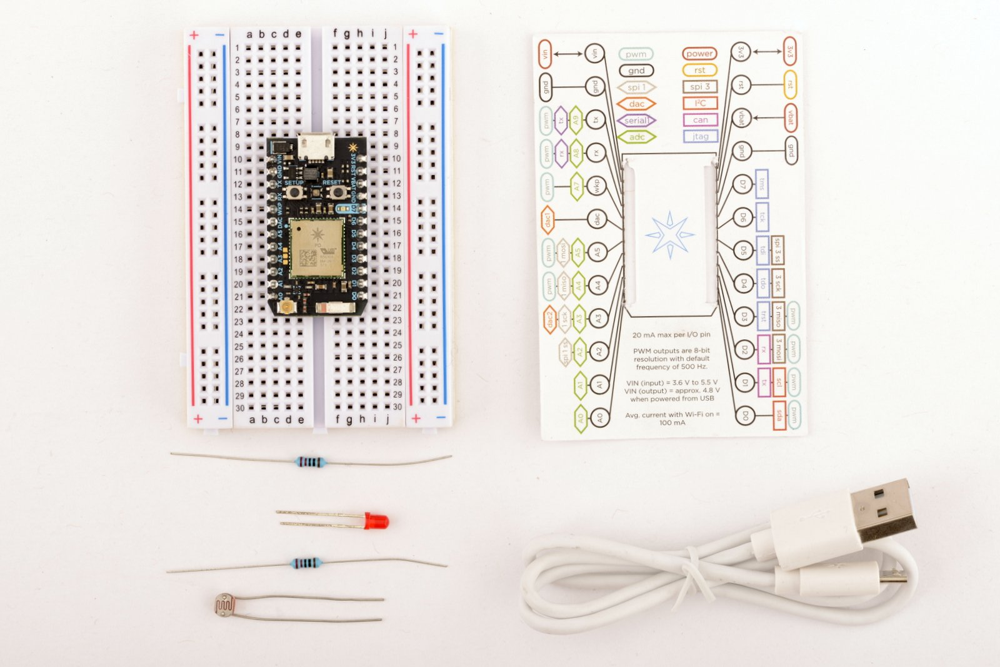
Make sure you connect to the correct Photon wifi!

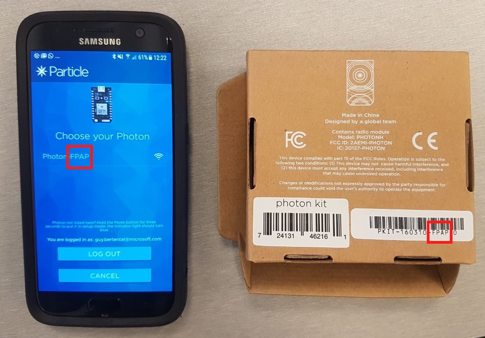
After this you should be able to control your Photon from your Mobile and have a particle cloud account.

## Step 2 - Provision Iot Hub on Azure and integrate with Particle cloud
1. Follow this tutorial - [https://docs.particle.io/tutorials/integrations/azure-iot-hub/](https://docs.particle.io/tutorials/integrations/azure-iot-hub/)
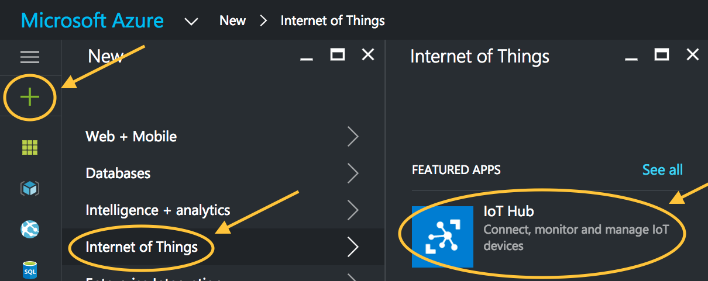
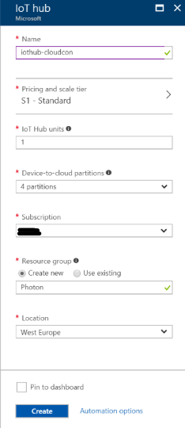
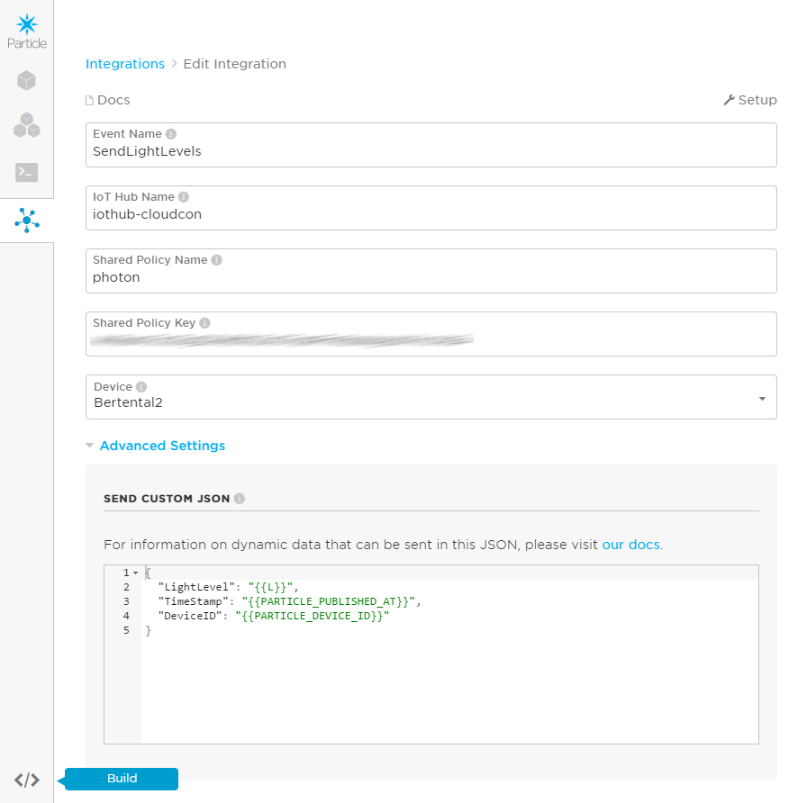

2. Type the following json in the "SEND CUSTOM JSON" Tab:
```
{
  "LightLevel": "{{L}}",
  "TimeStamp": "{{PARTICLE_PUBLISHED_AT}}",
  "DeviceID": "{{PARTICLE_DEVICE_ID}}"
}
```
## Step 3 - Wire up your Photon with Photoresistor and LED
1. Connect everything together as shown in the image below. The negative (shorter) pin of the LED is connected to ground via a resistor and the positive (longer) pin is connected to D0.
and connect Photoresistor to A0 and A5, while A5 leg connected to ground via a resistor.

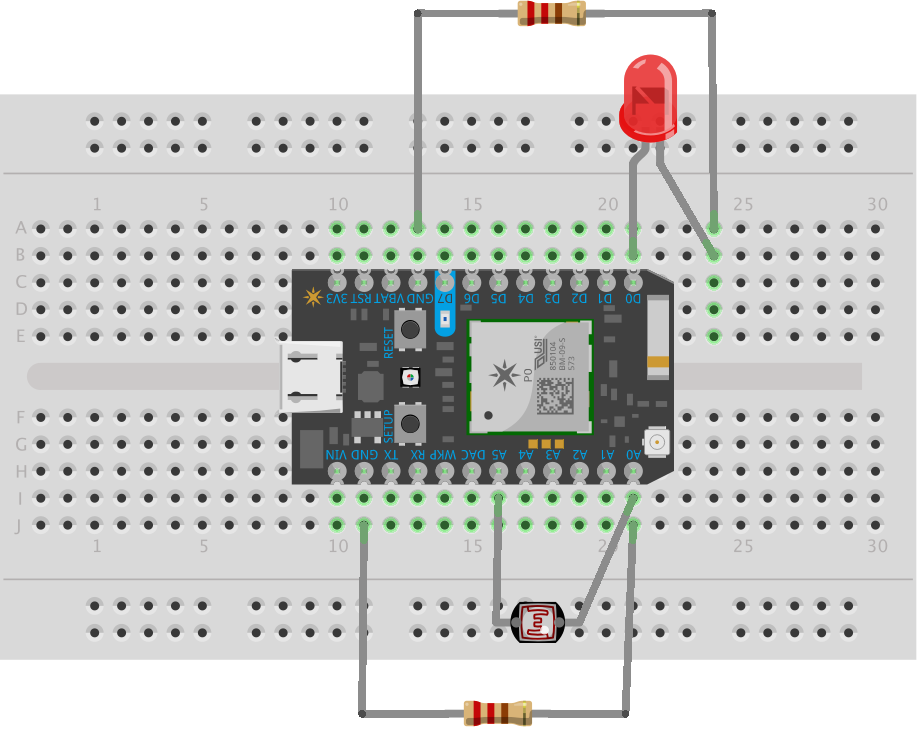

## Step 4 - Send light levels telemtry from Photon to cloud
1. Write C code on the Phone using online Particle IDE and click on save and flash buttons:
```
int led = D0;           // This is where your LED is plugged in. The other side goes to a resistor connected to GND.
int boardLed = D7;      // This is the LED that is already on your device (next to the D7 pin).
int photoresistor = A0; // This is where your photoresistor is plugged in. The other side goes to the "power" pin (below).
int power = A5;         // This is the other end of your photoresistor. The other side is plugged into the "photoresistor" pin (above).
int lightLevel;         // This will hold light levels from photoresistor.

// We start with the setup function.
void setup() {
  pinMode(led,OUTPUT);  // Our LED pin is output (lighting up the LED)
  pinMode(boardLed,OUTPUT); // Our on-board LED is output as well
  pinMode(photoresistor,INPUT);  // Our photoresistor pin is input (reading the photoresistor)
  pinMode(power,OUTPUT); // The pin powering the photoresistor is output (sending out consistent power)

  // Next, write the power of the photoresistor to be the maximum possible, which is 4095 in analog.
  digitalWrite(power,HIGH);
}

// Now for the loop.
void loop() {
  char payload[50];
  // turn on the board led as a sampling indicator
  digitalWrite(boardLed,HIGH);
  // read light level from the photoresistor
  lightLevel = analogRead(photoresistor);
  // format the payload
  snprintf(payload, sizeof(payload), "{ \"L\": %d }", lightLevel);
  // send telemetry to particle clould
  Particle.publish("SendLightLevels", payload, PRIVATE);
  // turn off the board led
  digitalWrite(boardLed,LOW);
  // Wait 5 seconds
  delay(5000); 
}
```
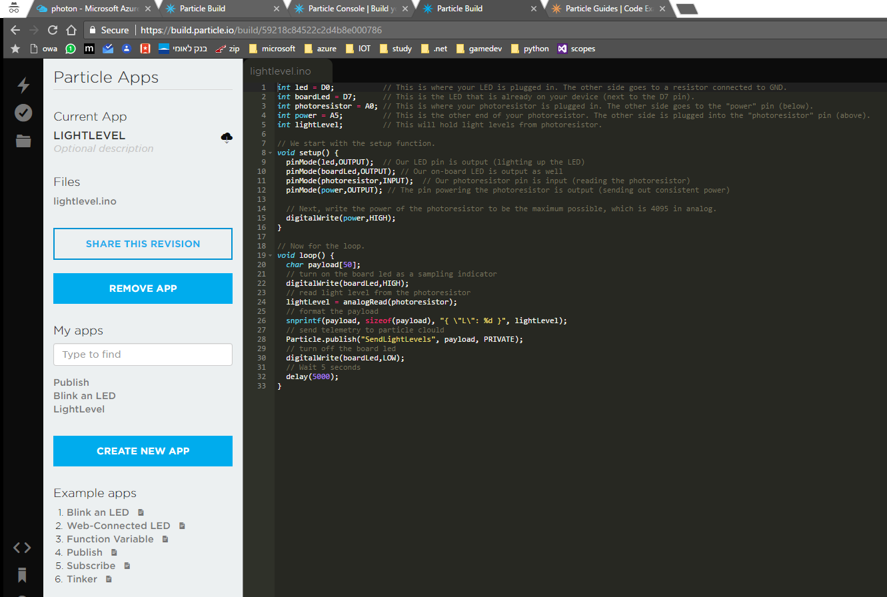

## Step 5 - Create Azure Stream Analytics job
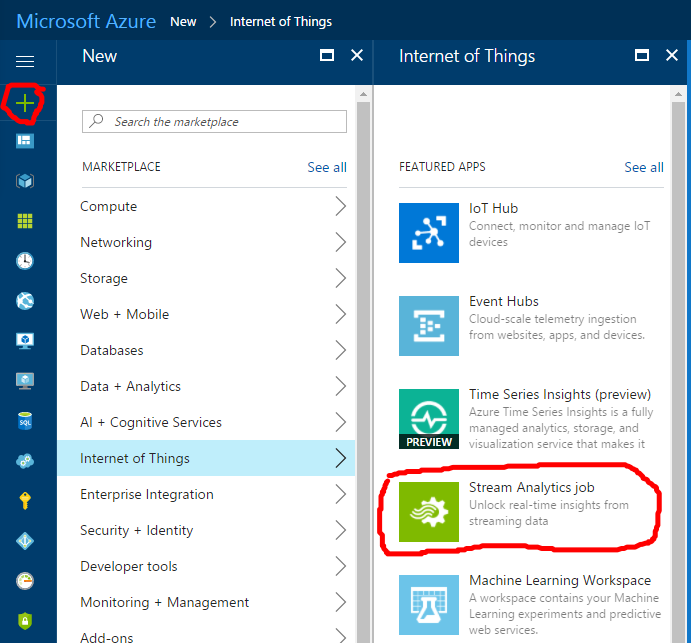

Make sure you create it in the same Resource Group:

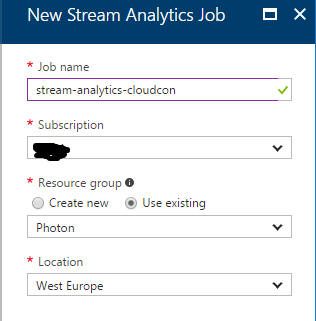

Define new input as your Iot Hub:

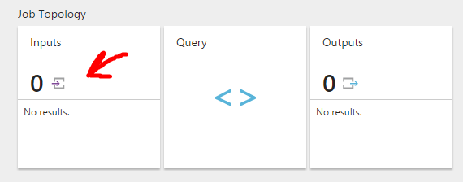

Make sure you type in the correct shared access policy which your have created in Step #2:

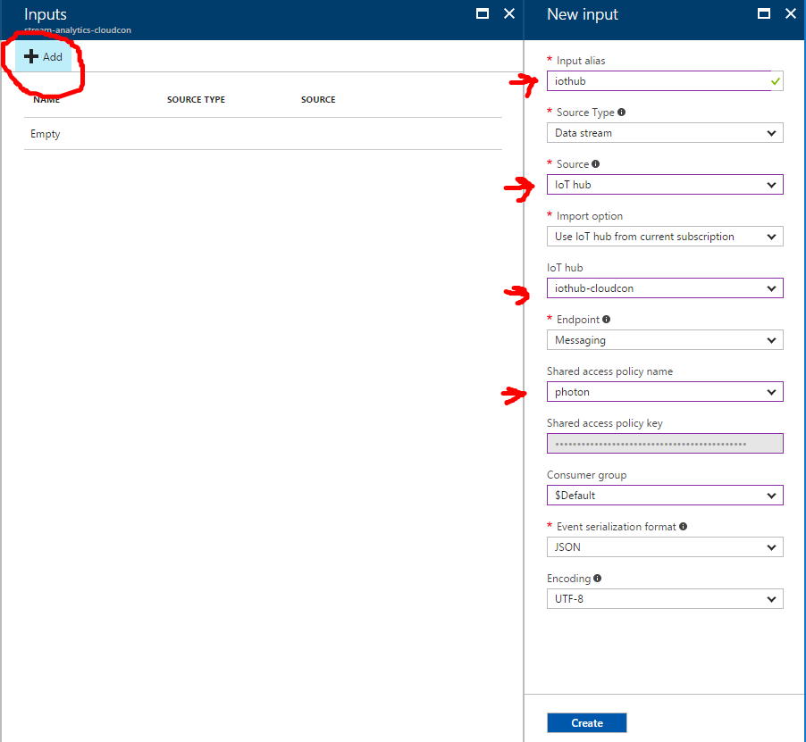


Define new output as your Power BI:

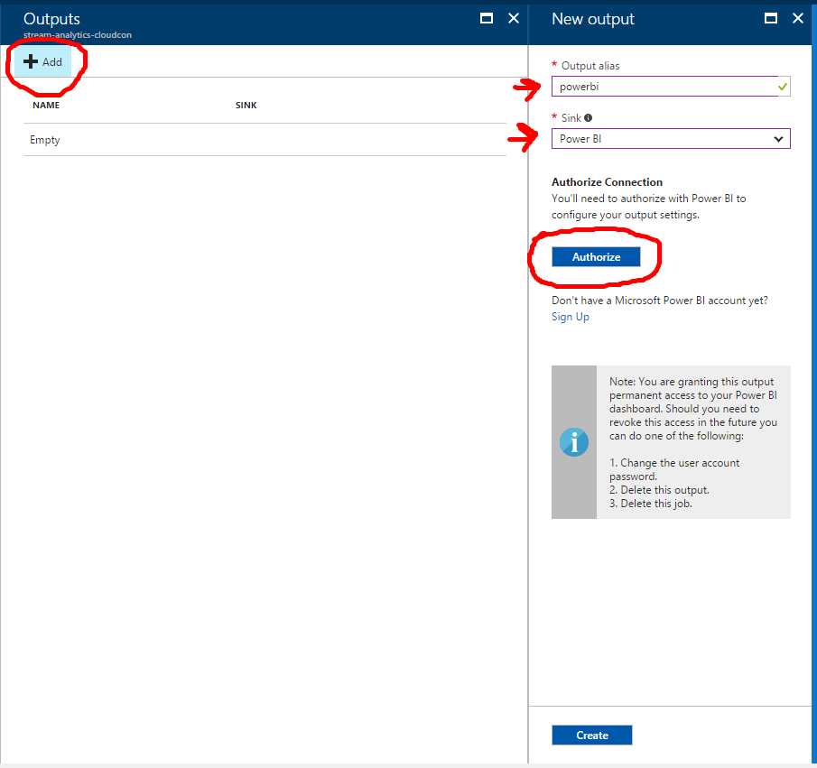

After authorizing your Power BI you'll be able to choose workspace, dataset and table names:

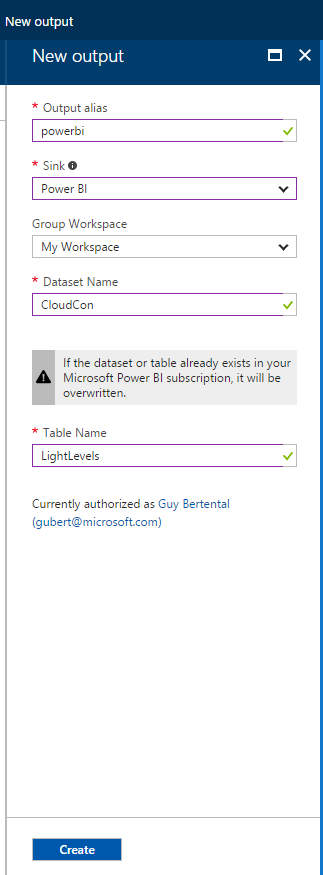

Define query for aggregating telemetry data from iothub into Power BI:
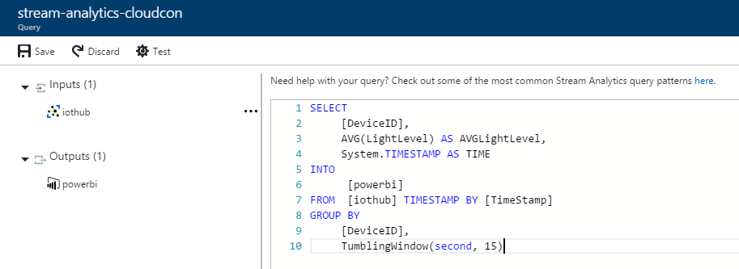

```
SELECT
     [DeviceID],
     AVG(LightLevel) AS AVGLightLevel,
     System.TIMESTAMP AS TIME
INTO
      [powerbi]
FROM  [iothub] TIMESTAMP BY [TimeStamp]
GROUP BY 
     [DeviceID],
     TumblingWindow(second, 15)
```
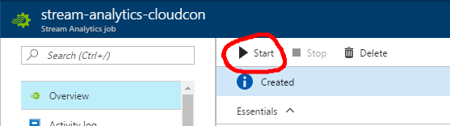


## Step 6 - Create Power BI report and dashboard
1. Sign into power bi [https://powerbi.microsoft.com/en-us/](https://powerbi.microsoft.com/en-us/)
2. Locate your dataset (CloudCon in our example) and click on create report:
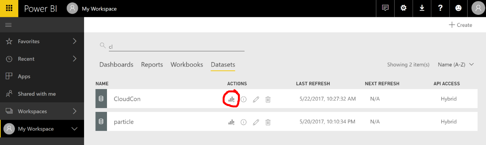
3. From the right pane select "avglightlevel" and "time" fields, choose line chart as visualization, resize the graph and add Text box for title:
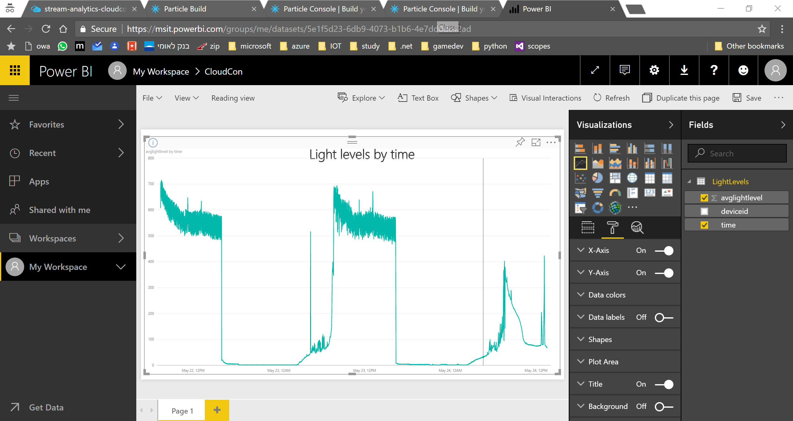
4. Save your report:
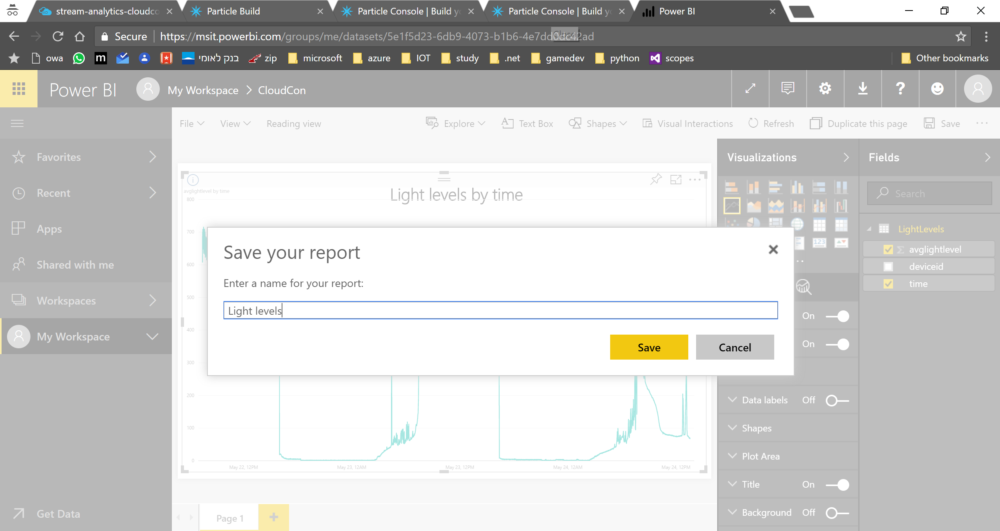


